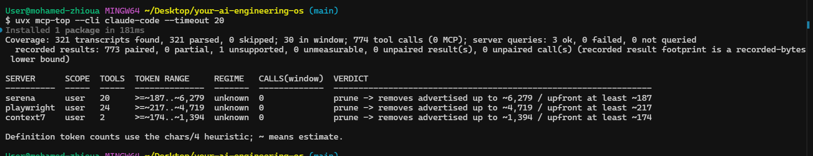

# mcp-top

> mcp-top profiles your local MCP context footprint: what servers advertise, what may load into context, and which tools your agents actually use.

License: MIT - Dependencies: none (Python stdlib, 3.11+)



*Real run against a Claude Code config: three MCP servers advertising ~12k tokens of tool definitions, with zero calls in the last 30 sessions. Token counts are chars/4 estimates; `~` marks an estimate.*

## Install

The PyPI package is available as of v0.5.0:

```sh
uvx mcp-top
```

```sh
pipx install mcp-top
```

```sh
pip install mcp-top
```

Clone-and-run still works:

```sh
python bin/mcp-top
```

You can also run the package module directly when `src` is on `PYTHONPATH`:

```sh
PYTHONPATH=src python -m mcp_top
```

## The Problem

MCP servers accumulate. Their advertised tools can be large, but modern clients do not all load those definitions the same way. Ordinary spend dashboards show money rather than context composition. `mcp-top` shows the join that is usually missing: advertised MCP footprint, possible upfront context footprint, and actual local usage.

## Quickstart

This real output is captured by the reproducible case study in [docs/examples/prune-case-study.md](docs/examples/prune-case-study.md):

```text
Coverage: 2 transcripts found, 2 parsed, 0 skipped; 2 in window; 3 tool calls (2 MCP); server queries: 2 ok, 0 failed, 0 not queried
  recorded results: 2 paired, 0 partial, 0 unsupported, 0 unmeasurable, 0 unpaired result(s), 0 unpaired call(s) (recorded result footprint is a recorded-bytes lower bound)

SERVER         SCOPE  TOOLS  TOKEN RANGE  REGIME   CALLS(window)  VERDICT
-------------  -----  -----  -----------  -------  -------------  ------------------------------------------------------------
unused-server  user   2      >=~23..~77   unknown  0              prune -> removes advertised up to ~77 / upfront at least ~23
used-server    user   2      >=~22..~76   unknown  2              review
  used-server recorded result footprint: 37 recorded UTF-8 byte(s) (lower bound) -> ~10 tok (estimate) across 2 result(s) (max ~5, p90 ~5)

used-server called tools:
  - first_tool: 1
  - second_tool: 1
```

Definition token counts use the chars/4 heuristic; `~` means estimate.

## The Tool Search Era

Default Claude Code can use Tool Search, so fixed definition-tax numbers are the wrong model: tool names and server instructions may load upfront while full tool schemas load only when needed. Cursor has Dynamic Context Discovery outside a stable local contract. Codex has its own upstream tool-search/deferred-exposure mechanism, but whether it is active for a given server is not observable from Codex's locally readable config, so `mcp-top` reports Codex servers as `unknown` rather than guessing.

`mcp-top` reports a range:

- `advertised_max_tokens`: estimated maximum if every advertised tool definition is loaded.
- `upfront_floor_tokens`: estimated lower bound that may load upfront, including tool names, server instructions, and always-loaded definitions when observable.
- `loading_regime`: `deferred`, `upfront`, or `unknown`.
- `regime_evidence`: the local file/key or documented client rule that produced the regime.

`unknown` is a valid answer. If the local files do not prove a loading regime, `mcp-top` says so rather than guessing from client versions or provider defaults. Token counts remain chars/4 estimates, and Claude Code's documented 2KB truncation of tool descriptions and server instructions is modeled before counting.

## Per-Project Usage

Usage is home-wide by default. Pass `--project-usage` to scope usage counts to the current `--project`.

Attribution is intentionally conservative. Claude transcripts contain a lossy project slug but no recorded current working directory, so Claude attribution is best-effort and slug-based. Codex sessions record `cwd`, so Codex attribution uses that recorded path after normalization. Sessions that cannot be attributed are reported and never guessed.

When `--project-usage` is active and the in-project window is empty, usage becomes `no-data`; `mcp-top` will not produce a confident prune verdict from an empty attributed window.

## Recorded-Result Footprint

Recorded-result footprint measures result payload text that is actually present in local transcripts: recorded UTF-8 bytes converted to `~bytes/4` token estimates. It is a lower bound on recorded bytes only. It is not a measure of model context, prompt input, invoices, or removal impact.

Human output adds a per-server line when measured result bytes exist. JSON adds `coverage.recorded_results` and per-server `recorded_result_footprint` with `total_bytes`, `total_tokens`, `max_tokens`, `p50_tokens`, `p90_tokens`, `lower_bound: true`, `basis: "recorded_utf8_bytes"`, and `token_estimate: "bytes/4"`.

Result taxonomy:

- `paired`: matched to a tool call and fully measured from inline text.
- `partial`: matched to a tool call; inline text was measured but opaque/non-text parts were present.
- `unsupported`: matched to a tool call but the content shape had no measurable inline text.
- `unmeasurable`: matched to a tool call but UTF-8 byte measurement failed.
- `unpaired`: result or call records that could not be matched by id.

## Loading-Regime Signals

Claude loading regimes are resolved only from documented, locally observable signals:

- `CLAUDE_CODE_DISABLE_EXPERIMENTAL_BETAS=1` is a hard off switch for Tool Search and resolves to `upfront`.
- `ENABLE_TOOL_SEARCH=true|false` takes precedence over soft provider defaults, including `ANTHROPIC_BASE_URL`.
- `ENABLE_TOOL_SEARCH=auto` and `auto:N` record threshold-mode evidence and stay `unknown`.
- `CLAUDE_CODE_USE_VERTEX=1` is treated as a documented default-off signal when `ENABLE_TOOL_SEARCH` is unset.
- Denying `ToolSearch` resolves to `upfront`; scoped `ToolSearch(...)` denial stays `unknown`.

There is no client-version inference. Model support is known to matter for Tool Search, but `mcp-top` does not encode a model allow/deny list because that would rot across model releases.

## Snapshots And Diff

`mcp-top snapshot` writes a redacted aggregate artifact using schema `mcp-top-snapshot/v1`:

```sh
mcp-top --home "$HOME" snapshot --out mcp-top-snapshot.json
```

Snapshots are designed to be safe to commit for normal use. They are allowlist-built and omit config env, args, command, URL, filesystem paths, errors, regime evidence, prune recipes, and result content. They retain server names and called-tool names as identifiers. Before public sharing, pass `--redact-identifiers` to replace those identifiers with deterministic unsalted SHA-256 pseudonyms.

`mcp-top diff` compares two snapshots and emits schema `mcp-top-diff/v1` with `--json`, or a human summary by default:

```text
Snapshot diff
old generated_at: 2026-07-18T14:58:11.150732+00:00
new generated_at: 2026-07-18T14:58:11.565212+00:00

=== claude-code ===
  removed: unused-server
  unchanged: 1 server(s)
```

Diffs show added and removed servers plus per-server deltas for advertised maximum, upfront floor, calls, recorded-result total tokens, loading regime, and verdict. If windows or project scopes differ, usage and recorded-result deltas are marked incomparable instead of pretending the populations match.

## Prune Suggestions

Add `--prune` to append a suggested-removal block. It is never applied: `mcp-top` is read-only and only tells you which file or command to review yourself.

Captured by `python scripts/examples/prune_case_study.py`:

```text
Suggested removals (never applied; mcp-top is read-only -- edit configs yourself):
  - [claude-code] unused-server (user) in C:\Users\User\AppData\Local\Temp\mcp-top-prune-case-study\home\.claude.json -> removes advertised up to ~77 / upfront at least ~23
      command: claude mcp remove --scope user unused-server
  (~ marks a chars/4 estimate, rough error +/-25%)

Prune candidates -- review before removing (actual removal impact unknown):
  none
```

`--prune` splits removals into two tiers:

- **Suggested removals**: a global user-scope server with an observed advertised maximum, an observed upfront floor, zero recent calls, and no lower-precedence server that would reactivate. Claude Code clean suggestions get a copy-pasteable `claude mcp remove --scope ...` command. Codex clean suggestions get structured guidance only: the exact file, `[mcp_servers.<name>]` table, and `enabled = false` line to add.
- **Prune candidates**: everything else that scored `prune` but cannot be recommended cleanly, including project-scoped servers, reactivation risk, unparsed config layers, unsupported usage, or incomplete attribution. Candidates get structured edit guidance only, not commands.

Reserved Claude Code server names (`workspace`, `claude-in-chrome`, `computer-use`, `Claude Preview`, `Claude Browser`) are never queried and never given a recipe: Claude Code itself skips them at load time regardless of config.

CLIs without a usage adapter, including Cursor, are reported as usage unavailable rather than an empty block.

## JSON

`--json` emits machine-readable schema `mcp-top/v3`. v0.5 keeps `mcp-top/v3` and adds fields without breaking the existing v3 contract.

Real excerpt from the case-study snapshot/report data:

```json
{
  "schema": "mcp-top/v3",
  "clis": [
    {
      "cli": "claude-code",
      "coverage": {
        "project_filter_active": false,
        "recorded_results": {
          "paired": 2,
          "partial": 0,
          "unsupported": 0,
          "unmeasurable": 0,
          "unpaired_results": 0,
          "unpaired_calls": 0
        }
      },
      "servers": [
        {
          "server": "used-server",
          "calls": 2,
          "advertised_max_tokens": {"value": 76, "exact": false},
          "upfront_floor_tokens": {"value": 22, "exact": false},
          "recorded_result_footprint": {
            "results": 2,
            "total_bytes": 37,
            "total_tokens": {"value": 10, "exact": false},
            "lower_bound": true,
            "basis": "recorded_utf8_bytes",
            "token_estimate": "bytes/4"
          }
        }
      ]
    }
  ]
}
```

JSON v3 rows use `advertised_max_tokens`, `upfront_floor_tokens`, `loading_regime`, and `regime_evidence`. v0.5 adds attribution fields on coverage, nullable `coverage.recorded_results`, and nullable per-server `recorded_result_footprint`. With `--prune`, each CLI entry gains a `suggested_removals` array with `removes_advertised_max_tokens`, `removes_upfront_floor_tokens`, `recipe`, `reactivates`, and `reasons`. The raw `ServerConfig` is never serialized because config args and env can contain secrets.

Snapshot JSON uses `mcp-top-snapshot/v1`. Diff JSON uses `mcp-top-diff/v1`.

## How It Works

1. Read supported CLI MCP configs from local files.
2. Query each configured stdio server read-only with MCP `initialize` and `tools/list` to fetch its actual tool inventory.
3. Model the server's advertised maximum and upfront floor using locally observable loading-regime evidence.
4. Parse local session transcripts through a versioned adapter and count tool calls in a recent window, defaulting to the last 30 sessions and 30 days.
5. Join context footprint to recent usage, rank servers, and print `keep`, `review`, `prune`, or `unknown` verdicts.

Naive timestamps are treated as UTC. Subagent transcripts are included and grouped under their parent session for windowing.

Querying definitions launches the configured server commands. `mcp-top` sends read-only protocol calls and kills the processes afterward. Use `--no-query` to skip launching servers; definition weights are then unknown.

## CLI Reference

`--home PATH`: home directory to inspect. Default: `~`.

`--project PATH`: project directory to inspect for project-scoped MCP config. Default: current working directory.

`--sessions N`: maximum recent parsed sessions to include. Default: `30`.

`--days N`: maximum transcript age for the usage window. Default: `30`.

`--timeout SECONDS`: per-server stdio query timeout. Default: `20.0`.

`--cli NAME`: CLI source to inspect: `claude-code`, `codex`, `cursor`, or `all`. Default: `all`. With `all`, only CLIs detected from local config or transcript paths are included.

`--no-query`: do not launch configured MCP servers. Default: off.

`--query-project`: also launch project-scope MCP servers (Claude project `.mcp.json`, Cursor project `.cursor/mcp.json`). Off by default because a project's config is untrusted input; pass this only for repositories you trust.

`--project-usage`: restrict usage counts to the current `--project`. Default: off, so usage is home-wide.

`--prune`: append a suggested-removal block in human output or a `suggested_removals` array per CLI with `--json`. Never applied.

`--json`: emit machine-readable JSON schema `mcp-top/v3` instead of the human table. Also accepted before subcommands for consistent option ordering.

`snapshot`: emit a redacted aggregate snapshot to stdout or `--out FILE`.

`snapshot --redact-identifiers`: pseudonymize server and called-tool names.

`diff OLD NEW`: compare two `mcp-top-snapshot/v1` files. Add `--json` for schema `mcp-top-diff/v1`.

`--version`: print the installed version and exit.

Exit code `0` means the report completed. Exit code `2` means invalid usage or an unexpected internal error. Skipped transcripts are reported in coverage and are not fatal.

## Honesty Rules

Coverage is always reported at the top of every output: found, parsed, skipped, skip reasons, usage-window count, attribution facts, recorded-result classification, tool calls, and server query status.

Token counts are labeled. `~` means an estimate from the `chars/4` heuristic, with rough error bars around +/-25%. Exact and estimated counts are never silently mixed.

Ranges obey `upfront_floor_tokens <= advertised_max_tokens`. If definitions cannot be observed, the range is `?` in human output and `null` in JSON.

Loading regimes carry evidence. Evidence is canonicalized to file/key/category style and never includes raw env values, command args, or secrets.

`mcp-top` is read-only. It never edits configs, uploads data, or sends telemetry.

Unknown Claude Code transcript format versions are reported and skipped. Codex transcript admission is structural because Codex ships frequently and records the CLI version in session metadata.

A zero-call verdict is `prune` only when definition weight was actually observed. With unobserved definition weight, zero calls is `review`. When a CLI has no measurable usage, calls are unknown and the verdict is `unknown`.

`--prune` only presents a clean removal for a global user-scope server whose deletion reactivates nothing. Anything else that scored `prune` is a review candidate with explicitly unknown removal impact.

`enabled_tools` names that were not returned by a server's `tools/list` snapshot are surfaced in coverage, phrased as "not returned by this snapshot." A malformed `enabled_tools`/`disabled_tools` value that is not a list is warned about and applies no filter.

## Verdicts

| Verdict | Default |
| --- | --- |
| `prune` | 0 calls with an observed advertised maximum |
| `review` | 1-3 calls, or 0 calls with unobserved definition weight |
| `keep` | More than 3 calls |
| `unknown` | Usage is unsupported or no attributed sessions exist |

## Supported CLIs

| CLI | Config inventory | Usage adapter |
| --- | --- | --- |
| Claude Code | Full: user, user-project/local, and project scopes. User-project/local outranks project. Project scope is inventory-only by default; reserved server names are inventory-only, never queried. | Full: JSONL transcript format `2.x`; project attribution is best-effort from the Claude project slug |
| Codex | User scope `~/.codex/config.toml`; project-layer `.codex/config.toml` is read and listed as conditional inventory, not queried and not merged | Rollout JSONL sessions under `~/.codex/sessions/**/rollout-*.jsonl`; project attribution uses recorded `cwd` |
| Cursor | User `~/.cursor/mcp.json` and project `.cursor/mcp.json` inventory; project scope is inventory-only by default | Not available; Cursor stores chats in undocumented per-workspace SQLite, so usage is unknown |

A Codex project-layer `.codex/config.toml` is reported but deliberately not queried or merged: Codex applies project layers only to trusted projects, reads a cascade of files from the project root down to the working directory, and field-merges same-name tables, so its per-server precedence cannot be reproduced faithfully from the published spec. See `docs/v0.3-provenance-and-prune.md`.

## Non-Goals

`mcp-top` is not a spend dashboard; `ccusage` exists for that. It is not an auto-pruner and never rewrites configs. It is not an MCP security scanner. There is no hosted service.

## Running Tests

```sh
bash tests/run.sh
```

## License

MIT.
